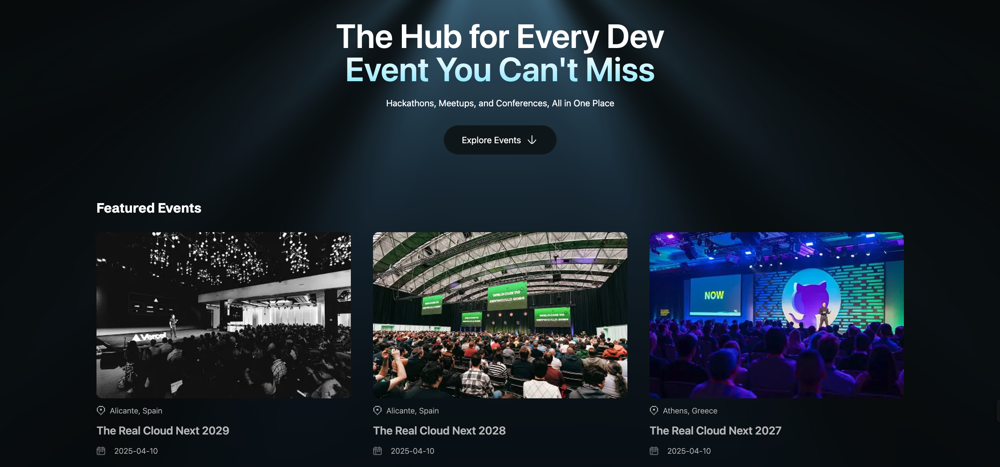
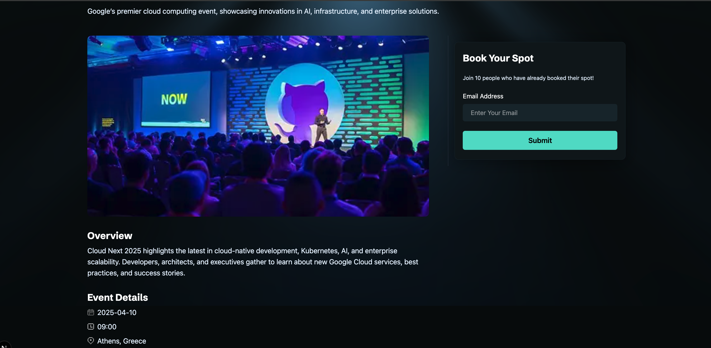

# Dev Radar

Dev Radar is a full-stack web application for discovering developer events such as conferences, meetups, and hackathons.

The application allows users to browse events, view detailed event information, discover similar events based on shared tags, and book a spot. Event data is stored in MongoDB, images are managed with Cloudinary, and the application is built with Next.js App Router and TypeScript.

## Screenshots

### Home Page



### Event Details



> Screenshots can be replaced with the latest application screenshots.

## Demo

A live demo can be added here once the application is deployed.

## Features

- Browse developer events
- Explore featured events on the homepage
- View detailed information about individual events
- Dynamic event pages using event slugs
- Discover similar events based on shared tags
- Book a spot for an event
- Store bookings in MongoDB
- Upload event images to Cloudinary
- REST API for event data
- Server-side data fetching
- Server-side database queries
- Next.js Cache Components
- Responsive UI
- Type-safe development with TypeScript

## Tech Stack

### Frontend

- Next.js 16
- React
- TypeScript
- Tailwind CSS
- Next.js App Router
- React Compiler

### Backend

- Next.js Route Handlers
- Next.js Server Components
- Next.js Server Functions
- REST API
- MongoDB
- Mongoose

### External Services

- MongoDB Atlas — database hosting
- Cloudinary — image storage and delivery

### Development

- Git
- npm
- Turbopack

## Architecture

Dev Radar uses the Next.js App Router as the main application architecture.

The frontend is built with React and Next.js Server Components. Event and booking data is stored in MongoDB and accessed through Mongoose.

Next.js Route Handlers provide the REST API for event operations.

Cloudinary is used to store event images, while MongoDB stores the image URLs together with the event data.

Server-side functions are used for database operations such as finding similar events.

### High-Level Architecture

```text
                         ┌──────────────────────┐
                         │        Browser       │
                         └──────────┬───────────┘
                                    │
                                    ▼
                         ┌──────────────────────┐
                         │   Next.js App Router │
                         │   React Components   │
                         └──────────┬───────────┘
                                    │
                 ┌──────────────────┼──────────────────┐
                 │                  │                  │
                 ▼                  ▼                  ▼
          ┌─────────────┐    ┌─────────────┐   ┌─────────────┐
          │ Route       │    │ Server      │   │ Dynamic     │
          │ Handlers    │    │ Functions   │   │ Event Pages │
          │ /api/events │    │             │   │ /events/... │
          └──────┬──────┘    └──────┬──────┘   └──────┬──────┘
                 │                  │                  │
                 └──────────────────┼──────────────────┘
                                    ▼
                         ┌──────────────────────┐
                         │       Mongoose       │
                         └──────────┬───────────┘
                                    │
                                    ▼
                         ┌──────────────────────┐
                         │     MongoDB Atlas    │
                         │                      │
                         │  Events / Bookings   │
                         └──────────────────────┘

                         ┌──────────────────────┐
                         │      Cloudinary      │
                         │    Event Images      │
                         └──────────────────────┘

What I Practiced

This project was built to practice full-stack development with the modern Next.js App Router architecture.

Frontend
Building reusable React components
Server Components and Client Components
Dynamic routes
Responsive layouts with Tailwind CSS
TypeScript interfaces and type-safe props
Next.js Image optimization
Backend
Building REST APIs with Next.js Route Handlers
Handling GET and POST requests
Processing multipart form data
Server-side database operations
Server Functions
Input validation
Error handling
Database
MongoDB integration
Mongoose schemas and models
ObjectId relationships
Querying documents
Filtering with MongoDB operators
Unique indexes
Timestamps
Using .lean() for read queries
External Services
MongoDB Atlas
Cloudinary image uploads
Environment variable configuration
Next.js
App Router
Dynamic segments
Server Components
Server Functions
Cache Components
cacheLife
Route Handlers
next/image


```
